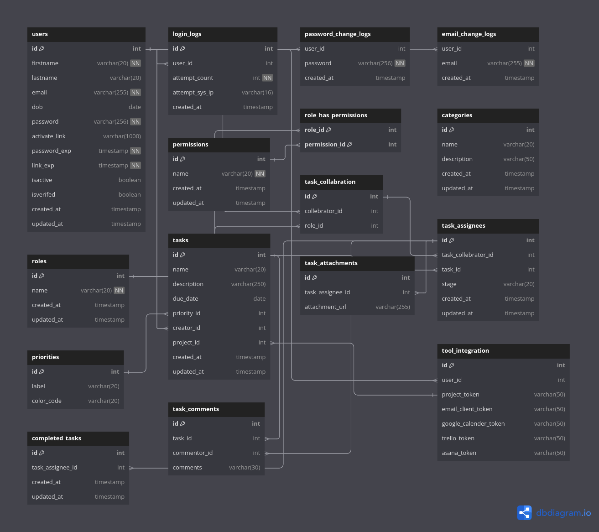

# Database Schema Design


- Title: `database schema design for different system`
- Author: `Bharat Makwama`

## Use

- mysql

## Directory Hierarchy

```
|—— attendence_sys.sql
|—— auction_platform.sql
|—— book_lib.sql
|—— food_recipe_sys.sql
|—— inventory_sys.sql
|—— mcq_exam_sys.sql
|—— mvp_e_commerce.sql
|—— task_sys.sql
```

## Design Preview

### Auction Platform

.png>)

### task management system



### mvp e-commerce

.png>)

### MCQ Exam System

.png>)

### Inventory Management System

.png>)

### Food Recipe System

.png>)

### Vertual Book Management System

.png>)

### Employee Attendence Management System

.png>)
